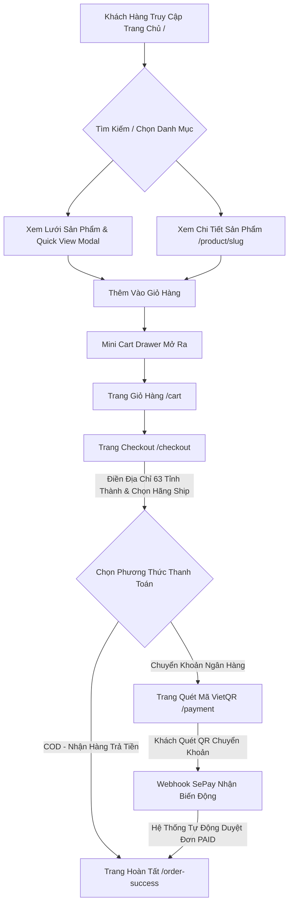

# 🛍️ TỔNG QUAN LUỒNG NGƯỜI DÙNG (USER STOREFRONT FLOW) & UI/UX ARCHITECTURE

> **Dự án:** ShopBig Web App  
> **Cập nhật:** 2026-08-18  
> **Framework:** Next.js 16 (App Router) + TypeScript + Vanilla CSS Modules  
> **Cơ sở dữ liệu:** MongoDB Atlas Cloud  

---

## 📑 MỤC LỤC

1. [Sơ Đồ Hành Trình Khách Hàng (User Journey Flow)](#1-sơ-đồ-hành-trình-khách-hàng-user-journey-flow)
2. [Chi Tiết Giao Diện & Trải Nghiệm UI/UX](#2-chi-tiết-giao-diện--trải-nghiệm-uiux)
   - [2.1. Thanh Header & Điều Hướng Toàn Cục](#21-thanh-header--điều-hướng-toàn-cục)
   - [2.2. Trang Chủ Bán Hàng (Home Page `/`)](#22-trang-chủ-bán-hàng-home-page-)
   - [2.3. Xem Nhanh Sản Phẩm (Quick View Modal)](#23-xem-nhanh-sản-phẩm-quick-view-modal)
   - [2.4. Trang Chi Tiết Sản Phẩm (`/product/[slug]`)](#24-trang-chi-tiết-sản-phẩm-productslug)
   - [2.5. Ngăn Kéo Giỏ Hàng (Mini Cart Drawer) & Trang Giỏ Hàng (`/cart`)](#25-ngăn-kéo-giỏ-hàng-mini-cart-drawer--trang-giỏ-hàng-cart)
   - [2.6. Trang Đặt Hàng & Checkout (`/checkout`)](#26-trang-đặt-hàng--checkout-checkout)
   - [2.7. Trang Quét Mã VietQR & Tự Động Xác Nhận (`/payment`)](#27-trang-quét-mã-vietqr--tự-động-xác-nhận-payment)
   - [2.8. Trang Đặt Hàng Thành Công (`/order-success`)](#28-trang-đặt-hàng-thành-công-order-success)
   - [2.9. Modal Đăng Nhập / Đăng Ký Tài Khoản (`AuthModal`)](#29-modal-đăng-nhập--đăng-ký-tài-khoản-authmodal)
3. [Danh Sách Toàn Bộ API Phục Vụ Luồng Khách Hàng](#3-danh-sách-toàn-bộ-api-phục-vụ-luồng-khách-hàng)
4. [Các Tính Năng Kỹ Thuật UI/UX Nổi Bật](#4-các-tính-năng-kỹ-thuật-uiux-nổi-bật)

---

## 1. SƠ ĐỒ HÀNH TRÌNH KHÁCH HÀNG (USER JOURNEY FLOW)

---

## 2. CHI TIẾT GIAO DIỆN & TRẢI NGHIỆM UI/UX

### 2.1. Thanh Header & Điều Hướng Toàn Cục
- **Banner Khuyến Mãi Topbar**: Hiển thị thông báo chiến dịch (VD: *"🔥 Miễn phí vận chuyển toàn quốc cho đơn hàng từ 500.000₫"*). Tự động bật/tắt và đổi nội dung theo Theme Admin.
- **Logo Thương Hiệu**: Hiển thị Logo ảnh hoặc Text Logo kèm hiệu ứng chuyển động.
- **Nút Chuyển Đổi Dark/Light Mode**: Chuyển đổi giao diện sáng/tối tức thì không cần reload.
- **Nút Giỏ Hàng (Cart Icon)**: Hiển thị số lượng mặt hàng (Badge) theo thời gian thực.
- **Nút Tài Khoản**: Mở Modal Đăng nhập / Đăng ký hoặc menu thông tin cá nhân.
- **Bottom Navigation**: Thanh menu cố định ở đáy màn hình điện thoại giúp thao tác một tay dễ dàng.

---

### 2.2. Trang Chủ Bán Hàng (Home Page `/`)
- **Hero Section**: Banner mở đầu ấn tượng với Tagline, nút kêu gọi hành động (CTA) và hiệu ứng thị giác.
- **Thanh Tìm Kiếm Realtime (`SearchBar`)**: Tìm kiếm sản phẩm trực tiếp khi gõ từ khóa.
- **Bộ Lọc Danh Mục Sản Phẩm**: Danh sách thẻ danh mục hiển thị số lượng sản phẩm thực tế (`productCount`), lọc sản phẩm ngay tại chỗ.
- **Lưới Sản Phẩm Thông Minh (`ProductCard`)**:
  - Huy hiệu Giảm Giá (% Sale) và Huy hiệu Sản phẩm Nổi Bật (Featured).
  - Hiển thị giá gốc gạch ngang và giá khuyến mãi nổi bật.
  - Xếp hạng sao đánh giá (Rating) và số lượng đã bán.
  - Nút **"Thêm Nhanh"** và nút **"Xem Nhanh (Quick View)"**.
- **Skeleton & Lazy Loading**: Tránh layout shift khi tải trang với hiệu ứng shimmer mượt mà.

---

### 2.3. Xem Nhanh Sản Phẩm (Quick View Modal)
- Xem thông tin chi tiết của sản phẩm ngay tại trang chủ mà không cần tải trang mới.
- Chọn biến thể **Màu Sắc** (Color Swatches) và **Kích Thước** (Size Pills).
- Tăng/giảm số lượng và hiển thị tồn kho thời gian thực.
- Nút bấm thêm vào giỏ hàng kèm hiệu ứng trượt mở Giỏ hàng tức thì.

---

### 2.4. Trang Chi Tiết Sản Phẩm (`/product/[slug]`)
- **Gallery Hình Ảnh Sản Phẩm**: Ảnh lớn sắc nét kèm danh sách thumbnail chuyển đổi linh hoạt.
- **Thông Tin Giá & Tiết Kiệm**: Tính toán số tiền tiết kiệm được rõ ràng.
- **Bộ Chọn Phân Loại Hàng Đa Tầng**: Chọn Màu sắc & Size, tự động cập nhật giá và số lượng tồn kho của biến thể tương ứng.
- **Cam Kết Dịch Vụ**:
  - 🚚 *Giao hàng hỏa tốc 2-4 ngày toàn quốc.*
  - 🔄 *Đổi trả dễ dàng trong 7 ngày.*
  - 🛡️ *100% hàng chính hãng, bảo hành chuẩn.*
- **Nút "Thêm Vào Giỏ"** & **Nút "Mua Ngay"** (dẫn thẳng tới Checkout).
- **Tab Mô Tả Chi Tiết**: Nội dung mô tả sản phẩm phong phú và thông số kỹ thuật.

---

### 2.5. Ngăn Kéo Giỏ Hàng (Mini Cart Drawer) & Trang Giỏ Hàng (`/cart`)
- **Mini Cart Drawer**: Trượt ra từ cạnh phải màn hình khi bấm Thêm giỏ hàng.
- **Tùy Chỉnh Giỏ Hàng**:
  - Tăng / giảm số lượng (+ / -) hoặc xóa món hàng.
  - Tự động tính toán lại Tổng tiền hàng (Subtotal).
  - Thanh tiến trình nhận diện điều kiện **Miễn Phí Vận Chuyển**.
- **Lưu Trữ Bền Vững**: Giỏ hàng lưu tại `localStorage` và đồng bộ tức thì với Context giỏ hàng.

---

### 2.6. Trang Đặt Hàng & Checkout (`/checkout`)
- **Thông Tin Khách Hàng**: Họ tên, Số điện thoại, Email nhận thông báo.
- **Bộ Chọn Địa Chỉ Chuẩn Hóa 63 Tỉnh Thành**:
  - Dropdown chọn **Tỉnh / Thành phố** (toàn bộ 63 tỉnh thành Việt Nam).
  - Dropdown **Quận / Huyện** tự động lọc theo Tỉnh/Thành đã chọn.
  - Dropdown **Phường / Xã** tương ứng.
  - Ô nhập số nhà, tên đường chi tiết.
- **Chọn Đơn Vị Vận Chuyển Tự Động (API 8.1)**:
  - ⚡ **Giao Hàng Nhanh (GHN)**: Giao nhanh 1 ngày.
  - 📦 **Giao Hàng Tiết Kiệm (GHTK)**: Tiết kiệm chi phí.
  - 🚚 **Viettel Post (VTP)**: Mạng lưới phủ rộng 63 tỉnh thành.
- **Chính Sách Freeship Thông Minh**: Tự động giảm $0₫$ phí vận chuyển nếu tổng đơn hàng $\ge$ ngưỡng cấu hình (VD: $500.000₫$).
- **Phương Thức Thanh Toán**:
  1. 💳 **Chuyển khoản Ngân hàng (Quét mã VietQR tự động)**
  2. 💵 **Thanh toán tiền mặt khi nhận hàng (COD)**
- **Nút "Hoàn Tất Đặt Hàng"**: Kiểm tra dữ liệu đầu vào và gửi đơn hàng sang hệ thống.

---

### 2.7. Trang Quét Mã VietQR & Tự Động Xác Nhận (`/payment`)
- **Mã VietQR Napas247 Chuẩn**:
  - Tự động tạo ảnh mã QR ngân hàng chứa chính xác: Số tài khoản, Ngân hàng, Số tiền thanh toán và Nội dung chuyển khoản mã đơn (`ST...`).
- **Cơ Chế Polling Realtime (`GET /api/payment/status?code=...`)**:
  - Giao diện chạy vòng lặp kiểm tra trạng thái thanh toán mỗi 2 giây.
  - Khách hàng quét mã trên App ngân hàng bất kỳ (Vietcombank, MBBank, Techcombank, Momo...).
  - Ngay khi SePay gửi Webhook tiền vào tài khoản $\to$ Màn hình thanh toán lập tức kích hoạt hiệu ứng thành công và tự động chuyển tiếp sang trang **Order Success** trong 1.5 giây.

---

### 2.8. Trang Đặt Hàng Thành Công (`/order-success`)
- Hiệu ứng tích xanh hoàn thành đơn hàng.
- Hiển thị **Mã Đơn Hàng (#ST...)**, Trạng thái thanh toán (*Đã thanh toán / Chờ thanh toán COD*).
- Tóm tắt danh sách mặt hàng, phí vận chuyển và tổng tiền đã thanh toán.
- Nút **"Tiếp Tục Mua Sắm"** và nút **"Xem Lịch Sử Đơn Hàng"**.

---

### 2.9. Modal Đăng Nhập / Đăng Ký Tài Khoản (`AuthModal`)
- Modal đăng nhập dạng Pop-up tiện lợi, hỗ trợ chuyển đổi qua lại giữa **Đăng Nhập** và **Đăng Ký**.
- Xác thực trường dữ liệu đầy đủ (Email hợp lệ, Mật khẩu $\ge 6$ ký tự, Số điện thoại).
- Đăng nhập thành công tự động lưu Token vào trình duyệt và cập nhật Avatar/Tên người dùng trên Header.

---

## 3. DANH SÁCH TOÀN BỘ API PHỤC VỤ LUỒNG KHÁCH HÀNG

### 🔐 1. Xác Thực & Người Dùng
- `POST /api/auth/login`: Đăng nhập khách hàng bằng Email/SĐT và mật khẩu.
- `POST /api/auth/register`: Đăng ký tài khoản khách hàng mới.
- `GET /api/auth/me`: Lấy thông tin tài khoản đang đăng nhập (Header `Authorization: Bearer <token>`).

### 📦 2. Sản Phẩm & Danh Mục
- `GET /api/categories`: Lấy toàn bộ danh mục sản phẩm (kèm đếm sản phẩm `productCount`).
- `GET /api/products`: Lấy danh sách sản phẩm (hỗ trợ lọc: `category`, `search`, `page`, `limit`, `sort`).
- `GET /api/products/[id]`: Xem chi tiết sản phẩm, ảnh gallery, phân loại màu sắc và kích cỡ.

### 🛒 3. Giỏ Hàng & Vận Chuyển
- `GET /api/cart` & `POST /api/cart`: Đồng bộ danh sách sản phẩm trong giỏ hàng.
- `POST /api/shipping/calculate`: So sánh cước phí và thời gian giao hàng của **GHN**, **GHTK**, **Viettel Post**.

### 🧾 4. Đơn Hàng & Thanh Toán VietQR
- `POST /api/orders`: Tạo đơn hàng mới từ Checkout (sinh mã đơn `ST...`).
- `GET /api/payment/status?code={orderCode}`: Polling realtime kiểm tra trạng thái thanh toán của đơn hàng.
- `POST /api/webhooks/sepay`: Endpoint nhận webhook biến động số dư ngân hàng từ SePay để tự động duyệt đơn sang `paid` và `confirmed`.

### 🎨 5. Cấu Hình Theme & Nhận Diện
- `GET /api/settings/theme`: Tải màu sắc chủ đạo, font chữ, logo, favicon, thông báo banner toàn trang.

---

## 4. CÁC TÍNH NĂNG KỸ THUẬT UI/UX NỔI BẬT

1. **Tuân Thủ 100% Theme CSS Variables**:
   Toàn bộ thành phần giao diện Storefront tự động cập nhật tức thì khi Admin thay đổi cấu hình Theme:
   - `--primary`: Màu sắc nút chính, giá khuyến mãi, điểm nhấn active.
   - `--bg-main`: Màu nền toàn bộ website.
   - `--bg-card`: Màu nền thẻ sản phẩm, modal popup, giỏ hàng drawer.
   - `--text-main` & `--text-muted`: Màu sắc văn bản tương phản cao chuẩn accessibility.

2. **Tối Ưu Trải Nghiệm Di Động (Mobile-First Design)**:
   - Bố cục lưới co giãn thông minh (1 cột trên mobile, 2 cột trên tablet, 4 cột trên desktop).
   - Menu Navigation Bottom Bar dành riêng cho thiết bị cảm ứng.

3. **Cơ Chế Thanh Toán Tự Động Không Cần Reload**:
   - Khách hàng không cần chụp ảnh màn hình chuyển khoản để tải lên.
   - Hệ thống Webhook SePay + Polling kiểm tra và đối soát tự động $100\%$.
