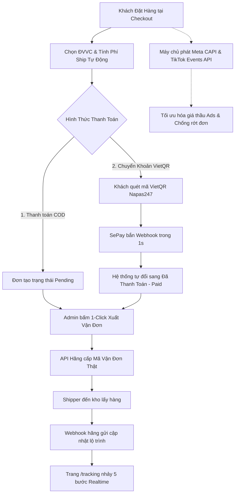

# 🛍️ ShopTik - Nền Tảng Thương Mại Điện Tử & Vận Hành Tự Động Hóa Toàn Diện

<p align="center">
  
</p>

<p align="center">
  <strong>Hệ sinh thái E-Commerce thế hệ mới: Đa Giao Diện Multi-Theme (Shopee/TikTok/Dark) • Vận chuyển Đa Hãng (GHN/GHTK/VTP) • Thanh toán VietQR SePay Tự Động 100% • Marketing Pixel & Conversions API (Meta CAPI & TikTok Events API) • Chat Realtime Socket.IO</strong>
</p>

<p align="center">
  
  
  
  
  
  
  
  
  
  
</p>

---

## 📑 MỤC LỤC

1. [✨ Tổng Quan & Kiến Trúc Tính Năng Nổi Bật](#-tổng-quan--kiến-trúc-tính-năng-nổi-bật)
2. [🎨 Hệ Thống Multi-Theme & Trải Nghiệm Người Dùng](#-hệ-thống-multi-theme--trải-nghiệm-người-dùng)
3. [🚀 Hướng Dẫn Cài Đặt & Khởi Chạy Nhanh](#-hướng-dẫn-cài-đặt--khởi-chạy-nhanh)
4. [⚙️ Hướng Dẫn Cấu Hình Tích Hợp Chi Tiết](#️-hướng-dẫn-cấu-hình-tích-hợp-chi-tiết)
   - [4.1. Cấu Hình Giao Hàng Nhanh (GHN)](#41-cấu-hình-giao-hàng-nhanh-ghn)
   - [4.2. Cấu Hình Giao Hàng Tiết Kiệm (GHTK)](#42-cấu-hình-giao-hàng-tiết-kiệm-ghtk)
   - [4.3. Cấu Hình Viettel Post (VTP)](#43-cấu-hình-viettel-post-vtp)
   - [4.4. Cấu Hình Thanh Toán Chuyển Khoản Tự Động SePay (VietQR)](#44-cấu-hình-thanh-toán-chuyển-khoản-tự-động-sepay-vietqr)
   - [4.5. Cấu Hình Facebook Pixel & Meta Conversions API (CAPI)](#45-cấu-hình-facebook-pixel--meta-conversions-api-capi)
   - [4.6. Cấu Hình TikTok Pixel & TikTok Events API](#46-cấu-hình-tiktok-pixel--tiktok-events-api)
   - [4.7. Cấu Hình Gửi Email Thông Báo (Gmail SMTP)](#47-cấu-hình-gửi-email-thông-báo-gmail-smtp)
5. [🌐 Danh Sách Endpoint & URL Webhook Toàn Hệ Thống](#-danh-sách-endpoint--url-webhook-toàn-hệ-thống)
6. [🔄 Sơ Đồ Luồng Vận Hành Tự Động Hóa 1-Chạm](#-sơ-đồ-luồng-vận-hành-tự-động-hóa-1-chạm)
7. [🛠️ Danh Sách Scripts Bảo Trì & Dữ Liệu Tiện Ích](#️-danh-sách-scripts-bảo-trì--dữ-liệu-tiện-ích)
8. [📱 Thông Tin Tài Khoản Quản Trị Mặc Định](#-thông-tin-tài-khoản-quản-trị-mặc-định)

---

## ✨ TỔNG QUAN & KIẾN TRÚC TÍNH NĂNG NỔI BẬT

### 🛍️ 1. Trải Nghiệm Mua Sắm Khách Hàng (Storefront)
- **Giao diện hiện đại & Tối ưu chuyển đổi:** Xây dựng trên Next.js 15 App Router, React 19, tải trang tức thì, hỗ trợ Responsive toàn diện trên Mobile / Tablet / Desktop.
- **Biến thể sản phẩm đa chiều (Multi-Dimensional Variants):** Chọn màu sắc, kích cỡ, phân loại với hình ảnh, giá bán và tồn kho biến thể linh hoạt.
- **Mô tả sản phẩm chuyên sâu & Khối xem thêm thông minh:** Bố cục khoa học gồm thông số kỹ thuật, bảng size, hướng dẫn bảo quản, cam kết chất lượng cùng hiệu ứng chuyển tiếp mờ (Gradient Fade Overlay) và nút Thu gọn/Xem toàn bộ.
- **Lựa chọn Đơn vị Vận chuyển thông minh tại Checkout:** Khách hàng trực tiếp chọn hãng vận chuyển yêu thích (GHN, GHTK, Viettel Post...), xem thời gian giao hàng dự kiến và phí ship tương ứng (tự động áp dụng Freeship khi đạt ngưỡng đơn hàng).
- **Cổng thanh toán quét mã VietQR Napas247:** Tự sinh mã QR ngân hàng kèm số tiền và cú pháp mã đơn hàng `ST...`. Khách chuyển khoản $\rightarrow$ Hệ thống tự động xác nhận trong 1 giây qua Webhook SePay!
- **Tra cứu lộ trình đơn hàng (`/tracking`):** Tiến trình 5 bước minh bạch, tra cứu hành trình Shipper và danh sách sản phẩm trực quan.

### ⚡ 2. Công Cụ Marketing, FOMO & Khuyến Mãi Đỉnh Cao
- **Khung Giờ Flash Sale Đa Dạng (Daily Slots):** Quản lý khung giờ lặp lại hàng ngày (11h-13h, 14h-16h...), ngày cụ thể hoặc khoảng ngày. Tự động đồng bộ đồng hồ đếm ngược (Countdown Timer) và tiến độ cháy hàng (% Sold Progress).
- **Hiệu Ứng Tâm Lý FOMO & Social Proof:**
  - 🔔 Popup "Khách vừa mua" hiển thị góc trái màn hình tăng độ tin cậy.
  - ⏳ Đồng hồ giữ ưu đãi đơn hàng tại trang Checkout thôi thúc hoàn tất đặt hàng.
  - 🔥 Số người đang cùng xem sản phẩm theo thời gian thực.
- **Hệ Thống Voucher & Mã Giảm Giá:** Giảm theo số tiền cố định (Fixed), giảm theo % có chặn mức tối đa (Max Discount), điều kiện giá trị đơn hàng tối thiểu (Min Order) và giới hạn lượt sử dụng trên từng khách hàng.

### 💬 3. Tin Nhắn CSKH Realtime & Chatbot Thông Minh
- **Socket.IO Server Chuyên Biệt (`server-socket.mjs`):** Kết nối thời gian thực tức thì giữa khách hàng và tư vấn viên quản trị shop.
- **Chatbot AI Tự Động:** Hỗ trợ giải đáp câu hỏi thường gặp, tư vấn sản phẩm, hướng dẫn chọn size và tra cứu tình trạng đơn hàng 24/7.

### 🚚 4. Vận Chuyển Đa Hãng Tự Động Hóa (GHN / GHTK / Viettel Post)
- **Tính cước động theo vị trí địa lý:** Gọi API tính phí chuẩn theo Tỉnh / Thành phố / Quận / Huyện / Phường / Xã.
- **Xuất đơn 1-Click tại Admin (`/admin/orders`):** Hệ thống tự động nhận diện đúng hãng khách hàng đã chọn tại Checkout. Admin chỉ cần 1 cú click là đơn được đẩy sang bưu cục và cấp mã vận đơn thật.
- **Cơ chế Fallback thông minh:** Tự động sinh mã vận đơn dự phòng nội bộ nếu API hãng tạm thời bảo trì hoặc chạm giới hạn tài khoản.
- **Hủy đơn 2 chiều:** Hủy đơn trên web $\rightarrow$ Tự động gửi tín hiệu hủy sang hệ thống hãng vận chuyển và dừng điều phối shipper.

### 📊 5. Đo Lường Marketing & Chuyển Đổi Nâng Cao (Meta CAPI & TikTok Events API)
- **Cơ chế đo lường kép Song Song (Client + Server):**
  - **Client-side Pixel:** Ghi nhận hành vi `PageView`, `ViewContent`, `AddToCart`, `InitiateCheckout`, `Purchase`.
  - **Server-side Conversions API:** Máy chủ tự động băm bảo mật SHA-256 (Email, SĐT, IP, User Agent, ttclid) và gửi thẳng sang Meta Graph API v19.0 & TikTok Business API v1.3.
- **Khử trùng lặp 100% (Event Deduplication):** Sử dụng chung mã `event_id` độc nhất cho mỗi lượt hành động, chống tính trùng số liệu đơn hàng.
- **Khắc phục rào cản AdBlock & iOS 14.5+:** Đảm bảo chiến dịch Facebook Ads & TikTok Ads nhận đủ 100% dữ liệu chuyển đổi để tối ưu hóa giá thầu CPA.
- **Báo cáo Phễu Chuyển Đổi Realtime:** Phân tích trực quan tỷ lệ rớt phễu qua từng bước từ Xem hàng $\rightarrow$ Thêm giỏ $\rightarrow$ Checkout $\rightarrow$ Mua hàng thành công.

---

## 🎨 HỆ THỐNG MULTI-THEME & TRẢI NGHIỆM NGƯỜI DÙNG

Website được trang bị hệ thống CSS Variables toàn diện, cho phép thay đổi giao diện tức thì không cần biên dịch lại mã nguồn:

| Tên Bộ Theme | Màu Chủ Đạo (Primary) | Nền Chính (Background) | Đặc Trưng Giao Diện |
| :--- | :---: | :---: | :--- |
| 🛍️ **Shopee Style** | Cam `#ee4d2d` | Nền sáng `#f5f5f5` / `#ffffff` | Chuẩn phong cách sàn Shopee, rực rỡ, sắc nét, tương phản cao |
| 🎵 **TikTok Dark** | Đỏ Hồng `#fe2c55` | Đen Tối `#121212` / `#1a1a1a` | Hiện đại, năng động, phong cách TikTok Shop thịnh hành |
| 🌙 **Sleek Dark Mode** | Xanh Dương `#3b82f6` | Đen Xanh Than `#090a0f` | Sang trọng, công nghệ, bảo vệ mắt |
| ☀️ **Clean Light Mode** | Xanh Dương `#2563eb` | Trắng Tinh `#f8fafc` | Thanh lịch, tươi sáng, dễ đọc nội dung |
| ⚙️ **Custom Palette** | Tùy biến mã màu HEX | Tùy biến toàn bộ components | Tự do chỉnh màu Button, Header, Sidebar, Text trong Admin |

---

## 🚀 HƯỚNG DẪN CÀI ĐẶT & KHỞI CHẠY NHANH

### 1. Yêu cầu môi trường:
- **Node.js:** `>= 18.17.0` (Khuyên dùng Node 20.x hoặc 22.x LTS)
- **MongoDB:** MongoDB Atlas Cloud hoặc MongoDB Local (v6.0+)

### 2. Cài đặt mã nguồn & dependencies:
```bash
# 1. Clone repository
git clone https://github.com/An07dev/AFF-Store.git
cd AFF-Store

# 2. Cài đặt thư viện
npm install
```

### 3. Cấu hình biến môi trường (`.env.local`):
Tạo file `.env.local` tại thư mục gốc của dự án:
```env
# 1. Cơ sở dữ liệu MongoDB
MONGODB_URI=mongodb+srv://<username>:<password>@cluster0.mongodb.net/webstore?retryWrites=true&w=majority

# 2. NextAuth & Bảo mật
NEXTAUTH_SECRET=your-super-secret-key-change-this-in-production
NEXTAUTH_URL=http://localhost:3000

# 3. Thanh toán VietQR Napas247
NEXT_PUBLIC_VIETQR_BANK=MSB
NEXT_PUBLIC_VIETQR_ACCOUNT_NO=0528438642
NEXT_PUBLIC_VIETQR_ACCOUNT_NAME="LE VAN AN"
SEPAY_API_KEY=your-sepay-api-key

# 4. Socket.IO Realtime
NEXT_PUBLIC_SOCKET_URL=http://localhost:3001
SOCKET_PORT=3001
```

### 4. Khởi chạy hệ thống (Development):
Hệ thống sử dụng 2 tiến trình song song (Web App + Socket Server):

```bash
# Terminal 1: Chạy Web App Next.js
npm run dev

# Terminal 2: Chạy Socket.IO Realtime Server (cho tính năng Chat CSKH)
npm run socket
```

👉 Mở trình duyệt truy cập: **`http://localhost:3000`**

### 5. Build kiểm tra bản Production:
```bash
npm run build
npm run start
```

---

## ⚙️ HƯỚNG DẪN CẤU HÌNH TÍCH HỢP CHI TIẾT

> 🌐 **Lưu ý:** Thay thế `<YOUR_DOMAIN>` bằng tên miền thật của bạn (Ví dụ: `https://shoptik.vn`).

---

### 4.1. Cấu Hình Giao Hàng Nhanh (GHN)

#### 🔹 Bước 1: Lấy Token API & Shop ID
1. Đăng nhập cổng đối tác: 👉 [khachhang.ghn.vn](https://khachhang.ghn.vn).
2. Vào **Quản lý tài khoản / Thông tin cá nhân**:
   - Copy chuỗi **Token API**.
   - Copy **Mã cửa hàng (Shop ID)**.
3. Đảm bảo mục **Địa chỉ kho lấy hàng** đã có địa chỉ và SĐT kho chính xác.

#### 🔹 Bước 2: Nhập vào Website
1. Mở trang quản trị: 👉 **`https://<YOUR_DOMAIN>/admin/shipping`**
2. Bấm **`[⚙️ Cấu Hình Token API & Shop ID]`** $\rightarrow$ Chọn tab **GHN**.
3. Dán **Token API** và **Shop ID** $\rightarrow$ Bấm **Lưu cấu hình**.
4. Bấm **`[Kiểm Tra Kết Nối]`** để kiểm tra phản hồi trực tiếp từ server GHN.

---

### 4.2. Cấu Hình Giao Hàng Tiết Kiệm (GHTK)

#### 🔹 Bước 1: Lấy Token API
1. Đăng nhập cổng đối tác: 👉 [khachhang.giaohangtietkiem.vn](https://khachhang.giaohangtietkiem.vn).
2. Vào **Cài đặt tài khoản** $\rightarrow$ **Tích hợp API** $\rightarrow$ Copy chuỗi **Token API**.

#### 🔹 Bước 2: Nhập vào Website
1. Mở trang quản trị: 👉 **`https://<YOUR_DOMAIN>/admin/shipping`** $\rightarrow$ Chọn tab **GHTK**.
2. Dán **Token API** $\rightarrow$ Bấm **Lưu cấu hình**.

#### 🔹 Bước 3: Cài đặt Webhook trên GHTK
1. Trên cổng GHTK, vào mục **Cấu hình Webhook** và điền:
   - **Trạng thái:** Tích chọn `◉ Hoạt động`.
   - **Data format:** Chọn `JSON`.
   - **URL đích:** 👉 **`https://<YOUR_DOMAIN>/api/webhooks/shipping?carrier=ghtk`**
2. Bấm **Lưu thông tin**.

---

### 4.3. Cấu Hình Viettel Post (VTP)

1. Đăng nhập cổng đối tác: 👉 [viettelpost.vn](https://viettelpost.vn).
2. Lấy **Token API** hoặc tài khoản Partner Viettel Post.
3. Mở **`https://<YOUR_DOMAIN>/admin/shipping`** $\rightarrow$ Chọn tab **Viettel Post** ➔ Dán thông tin và Lưu cấu hình.
4. Cài đặt Webhook URL trên Viettel Post: 👉 **`https://<YOUR_DOMAIN>/api/webhooks/shipping?carrier=viettelpost`**.

---

### 4.4. Cấu Hình Thanh Toán Chuyển Khoản Tự Động SePay (VietQR)

#### 🔹 Bước 1: Cấu hình Tài khoản nhận tiền trên Web
1. Mở trang quản trị: 👉 **`https://<YOUR_DOMAIN>/admin/payment`**
2. Điền thông tin ngân hàng thụ hưởng:
   - **Ngân hàng:** Chọn ngân hàng thụ hưởng (MBBank, Vietcombank, Techcombank, MSB, ACB...).
   - **Số tài khoản:** Nhập chính xác số tài khoản ngân hàng.
   - **Tên chủ tài khoản:** Nhập tên in hoa không dấu (Ví dụ: `LE VAN AN`).
3. Bấm **Lưu cấu hình tài khoản**.

#### 🔹 Bước 2: Tạo Webhook trên SePay
1. Đăng nhập: 👉 [my.sepay.vn](https://my.sepay.vn) $\rightarrow$ Liên kết tài khoản ngân hàng của bạn.
2. Vào mục **Tích hợp Webhook** $\rightarrow$ Bấm **Thêm Webhook**:
   - **URL Webhook (Gọi lại):** 👉 **`https://<YOUR_DOMAIN>/api/webhooks/sepay`**
   - **Data Format:** Chọn **`JSON`**
   - **Sự kiện kích hoạt:** Tích chọn **`Giao dịch tiền vào (in)`**
   - **Phương thức:** **`POST`**
3. Bấm **Lưu Webhook**. Khi khách thanh toán quét mã QR, SePay sẽ bắn thông báo và đơn hàng tự động chuyển sang `paid` tức thì!

---

### 4.5. Cấu Hình Facebook Pixel & Meta Conversions API (CAPI)

#### 🔹 Bước 1: Tạo Tập Dữ Liệu (Dataset / Pixel) trên Meta
1. Truy cập Cài đặt doanh nghiệp: 👉 [business.facebook.com/latest/settings/events_dataset_and_pixel](https://business.facebook.com/latest/settings/events_dataset_and_pixel).
2. Tại mục **Tập dữ liệu và pixel** $\rightarrow$ Bấm **`[+ Thêm]`**.
3. Đặt tên (Ví dụ: `ShopTik Pixel`) $\rightarrow$ Bấm **Tạo**.
4. **Gán quyền Quản trị viên (Bắt buộc):** Tích chọn tên tài khoản Facebook của bạn ➔ Bật **Toàn quyền kiểm soát** ➔ Bấm **Chỉ định**.
5. Copy **ID tập dữ liệu (Pixel ID)** *(Dãy số 15-16 chữ số, ví dụ: `1704901287459412`)*.

#### 🔹 Bước 2: Tạo Conversions API Access Token
1. Bấm **`[Mở trong Trình quản lý sự kiện]`** (Events Manager).
2. Chọn tab **Cài đặt (Settings)** $\rightarrow$ Cuộn xuống mục **API chuyển đổi (Conversions API)**.
3. Tại phần *Thiết lập thủ công* $\rightarrow$ Bấm **`[Tạo mã truy cập]`** *(Generate access token)*.
4. Copy mã token dài bắt đầu bằng **`EAAB...`**.

#### 🔹 Bước 3: Lấy Mã Thử Nghiệm (Test Event Code - Khi test)
1. Trong Events Manager, chuyển sang tab **Thử nghiệm sự kiện (Test events)**.
2. Mở mục **"Xác nhận rằng sự kiện của máy chủ được thiết lập đúng cách"** ➔ Copy mã **`TESTxxxxx`**.

#### 🔹 Bước 4: Nhập Cấu Hình Vào Website
1. Mở trang quản trị: 👉 **`https://<YOUR_DOMAIN>/admin/marketing`** $\rightarrow$ Chọn tab **Facebook Pixel & CAPI**.
2. Gạt sang **Đang Bật**, điền Pixel ID, CAPI Token, Mã TEST ➔ Bấm **Lưu cấu hình**.
3. Bấm nút: **`[🧪 Gửi sự kiện test lên Facebook CAPI]`** để xác thực nhận phản hồi `status: 200` từ Meta!
4. **Vận hành thực tế:** Sau khi test thành công, xóa trống ô Mã TEST và bấm Lưu lại.

---

### 4.6. Cấu Hình TikTok Pixel & TikTok Events API

#### 🔹 Bước 1: Tạo Pixel trên TikTok Ads Manager
1. Truy cập: 👉 [ads.tiktok.com/i18n/event_manager](https://ads.tiktok.com/i18n/event_manager).
2. Bấm **`[Connect data source]`** $\rightarrow$ Chọn **`Web`** $\rightarrow$ Bấm **Next**.
3. Chọn **Thiết lập thủ công** $\rightarrow$ Chọn **`API Pixel và Sự kiện TikTok (Khuyến khích)`**.
4. Đặt tên Pixel (Ví dụ: `ShopTik TikTok Pixel`) $\rightarrow$ Bấm **Tạo nên**.
5. Copy **TikTok Pixel ID** *(Ví dụ: `DA3SC0BC77UC1JSQM8E0`)*.

#### 🔹 Bước 2: Bật Đối Sánh Nâng Cao (AAM) & Chọn Phễu E-commerce
1. Bật công tắc **`Đối sánh nâng cao tự động (AAM)`**.
2. Chọn mẫu phễu **`E-commerce`** (Thương mại điện tử) $\rightarrow$ Bấm **Kế tiếp**.

#### 🔹 Bước 3: Tạo TikTok Events API Access Token
1. Tại bước *Triển khai API Sự kiện*, mục **1. Tạo mã truy cập** $\rightarrow$ Bấm nút màu đen: **`[Tạo mã truy cập]`**.
2. Copy chuỗi Access Token dài $\rightarrow$ Bấm **Kế tiếp** ➔ Bấm **Hoàn thành**.

#### 🔹 Bước 4: Nhập Cấu Hình Vào Website & Test
1. Mở trang quản trị: 👉 **`https://<YOUR_DOMAIN>/admin/marketing`** $\rightarrow$ Chọn tab **TikTok Pixel & Events API**.
2. Gạt sang **Đang Bật**, điền Pixel ID và Token $\rightarrow$ Bấm **Lưu cấu hình**.
3. Bấm nút màu hồng: **`[🧪 Gửi sự kiện test lên TikTok Events API]`** ➔ Nhận phản hồi `code: 0, message: "OK"` từ TikTok!

---

### 4.7. Cấu Hình Gửi Email Thông Báo (Gmail SMTP)

1. Đăng nhập Gmail gửi thư và bật **Xác minh 2 bước** tại: 👉 [myaccount.google.com/security](https://myaccount.google.com/security).
2. Tạo mật khẩu ứng dụng tại: 👉 [myaccount.google.com/apppasswords](https://myaccount.google.com/apppasswords) ➔ Copy chuỗi 16 ký tự.
3. Mở trang quản trị: 👉 **`https://<YOUR_DOMAIN>/admin/settings`** $\rightarrow$ Tab **Cấu Hình Email (SMTP)**:
   - **Tài khoản Email gửi:** Điền địa chỉ Gmail (vd: `cuahang.shoptik@gmail.com`).
   - **Mật khẩu SMTP:** Dán chuỗi 16 ký tự vừa tạo.
   - **Email Admin nhận thông báo:** Điền email của chủ shop.
4. Bấm **Lưu Cấu Hình Email** và bấm **`[Gửi Thử Email]`** để kiểm tra gửi thư tức thì.

---

## 🌐 DANH SÁCH ENDPOINT & URL WEBHOOK TOÀN HỆ THỐNG

### 1. Webhook Listeners (Bên thứ ba gọi vào)
| Dịch Vụ / Đối Tác | Phương Thức | URL Webhook Listener | Mục Đích Sử Dụng |
| :--- | :---: | :--- | :--- |
| **Giao Hàng Nhanh (GHN)** | `POST` | `https://<YOUR_DOMAIN>/api/webhooks/shipping?carrier=ghn` | Cập nhật lộ trình bưu tá GHN |
| **Giao Hàng Tiết Kiệm (GHTK)** | `POST` | `https://<YOUR_DOMAIN>/api/webhooks/shipping?carrier=ghtk` | Cập nhật lộ trình bưu tá GHTK |
| **Viettel Post (VTP)** | `POST` | `https://<YOUR_DOMAIN>/api/webhooks/shipping?carrier=viettelpost` | Cập nhật lộ trình bưu tá Viettel Post |
| **Thanh toán SePay VietQR** | `POST` | `https://<YOUR_DOMAIN>/api/webhooks/sepay` | Tự động xác nhận thanh toán Paid trong 1s |

### 2. Core REST APIs (Ứng dụng nội bộ & Client)
| Endpoint | Phương Thức | Mô Tả |
| :--- | :---: | :--- |
| `/api/products` | `GET`, `POST` | Lấy danh sách sản phẩm (hỗ trợ lọc danh mục, giá, bán chạy) / Tạo sản phẩm mới |
| `/api/products/[id]` | `GET`, `PUT`, `DELETE` | Chi tiết, cập nhật và xóa sản phẩm |
| `/api/categories` | `GET`, `POST` | Quản lý danh mục sản phẩm |
| `/api/orders` | `GET`, `POST` | Danh sách đơn hàng / Khách tạo đơn hàng mới |
| `/api/orders/[id]` | `GET`, `PUT` | Cập nhật trạng thái đơn, thanh toán, xuất vận đơn |
| `/api/flash-sale` | `GET`, `POST` | Lấy khung giờ Flash Sale đang LIVE & quản trị slots |
| `/api/vouchers` | `GET`, `POST` | Lấy danh sách voucher công khai / Áp dụng voucher kiểm tra giảm giá |
| `/api/tracking` | `GET`, `POST` | Tra cứu đơn hàng theo mã / Gửi sự kiện CAPI server-side |
| `/api/shipping/calculate` | `POST` | Tính phí vận chuyển thực tế qua API hãng |
| `/api/settings/[module]` | `GET`, `POST` | Quản lý cấu hình Theme, Vận chuyển, Thanh toán, Marketing |

---

## 🔄 SƠ ĐỒ LUỒNG VẬN HÀNH TỰ ĐỘNG HÓA 1-CHẠM



- **Hủy Đơn 2 Chiều:** Khi đơn bị hủy trên website $\rightarrow$ Hệ thống tự động gửi lệnh hủy API sang GHN/GHTK để hủy vận đơn và dừng điều shipper.

---

## 🛠️ DANH SÁCH SCRIPTS BẢO TRÌ & DỮ LIỆU TIỆN ÍCH

Trong thư mục `scripts/`, dự án cung cấp sẵn các công cụ bảo trì và tạo dữ liệu tự động:

```bash
# 1. Dọn dẹp sạch toàn bộ dữ liệu mẫu (Orders, Products, Categories, Chats, Analytics) mà GIỮ NGUYÊN cấu hình hệ thống:
node scripts/clean_database.js

# 2. Khởi tạo danh mục đa ngành hàng Hot Trend (Thời trang, Công nghệ, Gia dụng, Mỹ phẩm...):
node scripts/seed_categories.js

# 3. Khởi tạo bộ sản phẩm mẫu đầy đủ biến thể đa chiều và hình ảnh HD:
node scripts/seed_products.js

# 4. Cập nhật mô tả chi tiết chuyên sâu cho toàn bộ sản phẩm:
node scripts/update_detailed_descriptions.js

# 5. Bổ sung nhanh các danh mục mới (Bánh Trung Thu, Áo Đá Bóng...) kèm sản phẩm:
node scripts/add_two_categories_with_products.js
```

---

## 📱 THÔNG TIN TÀI KHOẢN QUẢN TRỊ MẶC ĐỊNH

- **Trang Quản Trị Hệ Thống:** `https://<YOUR_DOMAIN>/admin`
- **Tài khoản Admin mặc định:**
  - **Email:** `admin@shoptik.vn`
  - **Mật khẩu:** `admin123` *(hoặc mật khẩu do quản trị viên thiết lập)*
- **Tài khoản Nhân viên (Staff):**
  - **Email:** `staff@shoptik.vn`
  - **Mật khẩu:** `staff123`

---

<p align="center">
  Made with ❤️ by <strong>ShopTik Engineering Team</strong> • Sẵn sàng mở rộng và triển khai quy mô lớn.
</p>
