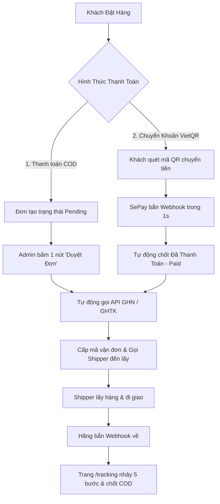

# 🛍️ ShopTik - Nền Tảng Thương Mại Điện Tử & Vận Hành Tự Động Hóa

<p align="center">
  
</p>

<p align="center">
  <strong>Hệ thống E-Commerce hiện đại tích hợp Vận chuyển GHN / GHTK và Cổng thanh toán VietQR SePay tự động 100%</strong>
</p>

<p align="center">
  
  
  
  
  
  
  
</p>

---

## 📑 MỤC LỤC

1. [✨ Tính Năng Nổi Bật](#-tính-năng-nổi-bật)
2. [🚀 Khởi Chạy Dự Án](#-khởi-chạy-dự-án)
3. [📦 HƯỚNG DẪN CẤU HÌNH VẬN CHUYỂN, THANH TOÁN, MARKETING & EMAIL](#-hướng-dẫn-cấu-hình-vận-chuyển--thanh-toán)
   - [3.1. Cấu Hình Giao Hàng Nhanh (GHN)](#31-cấu-hình-giao-hàng-nhanh-ghn)
   - [3.2. Cấu Hình Giao Hàng Tiết Kiệm (GHTK)](#32-cấu-hình-giao-hàng-tiết-kiệm-ghtk)
   - [3.3. Cấu Hình Thanh Toán Tự Động SePay (VietQR)](#33-cấu-hình-thanh-toán-tự-động-sepay-vietqr)
   - [3.4. Cấu Hình Gửi Email Thông Báo Đơn Hàng (Gmail SMTP / Nodemailer)](#34-cấu-hình-gửi-email-thông-báo-đơn-hàng-gmail-smtp--nodemailer)
   - [3.5. Cấu Hình Facebook Pixel & Conversions API (CAPI) Chuẩn Meta](#35-cấu-hình-facebook-pixel--conversions-api-capi-chuẩn-meta)
4. [🌐 Danh Sách URL Webhook Cần Cài Đặt](#-danh-sách-url-webhook-cần-cài-đặt)
5. [🔄 Luồng Vận Hành Tự Động Hóa 1-Chạm](#-luồng-vận-hành-tự-động-hóa-1-chạm)
6. [📱 Thông Tin Tài Khoản Quản Trị](#-thông-tin-tài-khoản-quản-trị)

---

## ✨ TÍNH NĂNG NỔI BẬT

- **🛒 Giao Diện Mua Sắm Khách Hàng:**
  - Trang chủ hiện đại, bộ lọc danh mục, chi tiết sản phẩm đa biến thể (màu sắc, kích cỡ).
  - Giỏ hàng thông minh, tính phí vận chuyển theo thời gian thực (Real-time).
  - **Trang Theo Dõi Đơn Hàng (`/tracking`):** Chuẩn hóa tiến trình 5 bước minh bạch, đồng bộ sản phẩm từ API và hành trình Shipper.

- **🚚 Vận Chuyển Đa Hãng (GHN & GHTK):**
  - Tự động gọi API tính cước thật theo địa chỉ khách hàng.
  - **Duyệt đơn 1-chạm:** Admin chỉ cần bấm Duyệt đơn $\rightarrow$ Tự động đẩy đơn sang hãng khách đã chọn và cấp mã vận đơn thật.
  - **Hủy đơn 2 chiều:** Hủy đơn trên web $\rightarrow$ Tự động hủy đơn trên hệ thống của hãng và dừng điều shipper.
  - **Nhận Webhook 5 bước:** Đồng bộ lộ trình bưu tá giao hàng tự động.

- **⚡ Thanh Toán Chuyển Khoản Tự Động (VietQR + SePay):**
  - Tự động sinh mã VietQR Napas247 kèm đúng số tiền và nội dung chuyển khoản `ST...`.
  - Khách chuyển tiền $\rightarrow$ SePay bắn Webhook trong 1 giây $\rightarrow$ **Tự động chuyển Paid & tự động đẩy hãng vận chuyển ngay lập tức**!

- **⚙️ Bảng Quản Trị Admin Đầy Đủ:**
  - Quản lý sản phẩm, đơn hàng, khách hàng, báo cáo doanh thu.
  - Modal quản trị cấu hình Token API & Shop ID động lưu trực tiếp vào MongoDB Atlas.

---

## 🚀 KHỞI CHẠY DỰ ÁN

### 1. Cài đặt dependencies:
```bash
npm install
```

### 2. Chạy server phát triển (Development):
```bash
npm run dev
```
👉 Mở trình duyệt truy cập: **`http://localhost:3000`**

### 3. Build kiểm tra bản Production:
```bash
npm run build
```

---

## 📦 HƯỚNG DẪN CẤU HÌNH VẬN CHUYỂN & THANH TOÁN

> 🌐 **Quy Ước Tên Miền:** Thay thế `<YOUR_DOMAIN>` bằng tên miền chính thức của website (Ví dụ: `https://yourdomain.com`).

---

### 3.1. Cấu Hình Giao Hàng Nhanh (GHN)

#### 🔹 Bước 1: Lấy Token & Shop ID trên GHN
1. Đăng nhập cổng đối tác: 👉 [khachhang.ghn.vn](https://khachhang.ghn.vn) (hoặc [sso.ghn.vn](https://sso.ghn.vn)).
2. Vào **Thông tin cá nhân / Quản lý tài khoản**:
   - Copy **Token API** *(Chuỗi dạng UUID do GHN cấp)*.
   - Copy **Mã cửa hàng (Shop ID)** *(Dãy số định danh kho của bạn)*.
3. Đảm bảo mục **Địa chỉ kho** đã có địa chỉ lấy hàng và SĐT kho.

#### 🔹 Bước 2: Nhập vào Website
1. Mở trang quản trị: 👉 **`https://<YOUR_DOMAIN>/admin/shipping`**
2. Bấm **`[⚙️ Cấu Hình Token API & Shop ID (Modal)]`** $\rightarrow$ Chọn tab **`GHN`**.
3. Dán **Token API** và **Shop ID** $\rightarrow$ Bấm **`Lưu Cấu Hình Vào Database`**.
4. Bấm nút **`[Kiểm Tra Kết Nối]`** để xác thực trực tiếp với server GHN.

---

### 3.2. Cấu Hình Giao Hàng Tiết Kiệm (GHTK)

#### 🔹 Bước 1: Lấy Token API trên GHTK
1. Đăng nhập cổng đối tác: 👉 [khachhang.giaohangtietkiem.vn](https://khachhang.giaohangtietkiem.vn).
2. Vào **Cài đặt tài khoản** $\rightarrow$ **Tích hợp API / Token API** $\rightarrow$ Copy chuỗi **Token API**.

#### 🔹 Bước 2: Nhập vào Website
1. Mở trang quản trị: 👉 **`https://<YOUR_DOMAIN>/admin/shipping`**
2. Bấm **`[⚙️ Cấu Hình Token API & Shop ID (Modal)]`** $\rightarrow$ Chọn tab **`GHTK`**.
3. Dán **Token API** $\rightarrow$ Bấm **`Lưu Cấu Hình Vào Database`**.
4. Bấm **`[Test API GHTK]`** để xác thực trực tiếp với server GHTK.

#### 🔹 Bước 3: Cài đặt Webhook trên GHTK
1. Trên [khachhang.giaohangtietkiem.vn](https://khachhang.giaohangtietkiem.vn), vào mục **Cấu hình Webhook**.
2. Điền chính xác các ô:

| Tên Trường Trên GHTK | Giá Trị Cần Điền / Chọn |
| :--- | :--- |
| **Trạng thái \*** | Tích chọn **`◉ Hoạt động`** *(màu xanh lá)* |
| **Data format** | Chọn **`JSON`** *(hoặc `application/json`)* |
| **URL đích \*** | 👉 **`https://<YOUR_DOMAIN>/api/webhooks/shipping?carrier=ghtk`** |
| **Headers** | Để trống *(không cần điền)* |

3. Bấm **`[Lưu thông tin]`**.

---

### 3.3. Cấu Hình Thanh Toán Tự Động SePay (VietQR)

#### 🔹 Bước 1: Cấu hình Tài khoản nhận tiền trên Web
1. Mở trang quản trị: 👉 **`https://<YOUR_DOMAIN>/admin/payment`**
2. Điền thông tin tài khoản ngân hàng của bạn:
   - **Ngân hàng:** Chọn ngân hàng thụ hưởng *(ví dụ: `MBBank`, `Vietcombank`, `Techcombank`,...)*.
   - **Số tài khoản \*:** Nhập số tài khoản ngân hàng của bạn.
   - **Tên chủ tài khoản \*:** Nhập tên chủ tài khoản in hoa không dấu *(ví dụ: `NGUYEN VAN A`)*.
3. Bấm **`[Lưu cấu hình tài khoản]`**.

#### 🔹 Bước 2: Cài đặt Webhook trên SePay
1. Đăng nhập: 👉 [my.sepay.vn](https://my.sepay.vn) $\rightarrow$ Liên kết tài khoản ngân hàng của bạn.
2. Vào **Tích hợp Webhook** $\rightarrow$ Bấm **Thêm Webhook**:

| Trường Thông Tin | Giá Trị Cần Điền |
| :--- | :--- |
| **URL Webhook (Gọi lại)** | 👉 **`https://<YOUR_DOMAIN>/api/webhooks/sepay`** |
| **Data Format** | Chọn **`JSON`** |
| **Sự kiện kích hoạt** | Tích chọn **`Giao dịch tiền vào (in)`** |
| **Phương thức** | **`POST`** |

3. Bấm **Lưu Webhook**.

---

### 3.4. Cấu Hình Gửi Email Thông Báo Đơn Hàng (Gmail SMTP / Nodemailer)

Hệ thống hỗ trợ tự động gửi:
- **Email cho Khách hàng:** Hóa đơn điện tử chi tiết sản phẩm, số tiền, địa chỉ và link tra cứu đơn.
- **Email cho Admin:** Cảnh báo có đơn mới cần xử lý ngay lập tức.

#### 🔹 Bước 1: Tạo Mật khẩu ứng dụng Gmail (Google App Password)
1. Đăng nhập tài khoản Gmail gửi thư và đảm bảo đã **Bật xác minh 2 bước** tại: 👉 [myaccount.google.com/security](https://myaccount.google.com/security).
2. Truy cập trang tạo mật khẩu ứng dụng Google: 👉 [myaccount.google.com/apppasswords](https://myaccount.google.com/apppasswords).
3. Đặt tên ứng dụng (Ví dụ: `ShopTik Web`) $\rightarrow$ Bấm **Tạo (Create)**.
4. Copy chuỗi **16 ký tự** màu vàng Google cấp (Ví dụ: `abcd efgh ijkl mnop`).

#### 🔹 Bước 2: Nhập Cấu Hình Vào Trang Quản Trị
1. Mở trang quản trị: 👉 **`https://<YOUR_DOMAIN>/admin/settings`** $\rightarrow$ Chọn tab **`Cấu Hình Email (SMTP)`**.
2. Điền thông tin:
   - **Kích hoạt gửi Email tự động:** Bật `[x]`.
   - **Tài khoản Email gửi (Gmail):** Điền địa chỉ Gmail của bạn *(vd: `cuahang.shoptik@gmail.com`)*.
   - **Mật khẩu ứng dụng SMTP:** Dán chuỗi 16 ký tự vừa copy ở Bước 1.
   - **Tên người gửi:** `ShopTik Store` *(hoặc tên shop của bạn)*.
   - **Email Admin nhận thông báo:** Điền hộp thư của chủ shop.
3. Bấm **`[Lưu Cấu Hình Email]`**.

#### 🔹 Bước 3: Kiểm tra gửi thử (Test Email)
- Tại mục **"Kiểm Tra Kết Nối Gửi Thư"** ở dưới cùng trang, nhập email của bạn và bấm **`[Gửi Thử Email]`** để xác thực kết nối ngay lập tức.

#### 🔹 Cấu hình qua biến môi trường `.env` (Tùy chọn):
Nếu bạn muốn nạp sẵn cấu hình qua file `.env` / Vercel Environment Variables:
```env
SMTP_HOST=smtp.gmail.com
SMTP_PORT=465
SMTP_USER=cuahang.shoptik@gmail.com
SMTP_PASS=abcdefghijklmnop
SMTP_SENDER_NAME="ShopTik Store"
ADMIN_NOTIFICATION_EMAIL=admin@shoptik.vn
```

---

### 3.5. Cấu Hình Facebook Pixel & Conversions API (CAPI) Chuẩn Meta

Hệ thống hỗ trợ cơ chế đo lường chuyển đổi chuẩn Meta song song:
- **Client-side Pixel (Trình duyệt):** Ghi nhận `PageView`, `ViewContent`, `AddToCart`, `InitiateCheckout`, `Purchase`.
- **Server-side CAPI (Máy chủ):** Tự động gửi dữ liệu đơn hàng kèm mã băm SHA-256 (Email, Số điện thoại, IP, User Agent) trực tiếp từ máy chủ sang Meta Graph API v19.0.
- **Khử trùng lặp (Event Deduplication):** Sử dụng chung mã `event_id` độc nhất giúp Facebook tự động gộp sự kiện, chống trùng lặp số liệu 100%.
- **Chống AdBlock & iOS 14.5+:** Đảm bảo không bị thất thoát 30-40% số liệu đơn hàng khi chạy quảng cáo Facebook Ads.

#### 🔹 Bước 1: Tạo Pixel / Tập dữ liệu (Dataset) trên Meta Business Suite
1. Truy cập trang Cài đặt doanh nghiệp: 👉 [business.facebook.com/latest/settings/events_dataset_and_pixel](https://business.facebook.com/latest/settings/events_dataset_and_pixel) (hoặc [Meta Events Manager](https://adsmanager.facebook.com/events_manager2)).
2. Tại mục **Tập dữ liệu và pixel** $\rightarrow$ Bấm **`[+ Thêm]`**.
3. Đặt tên cho Pixel (Ví dụ: `ShopTik Pixel`) $\rightarrow$ Bấm **Tạo (Create)**.
4. **Gán quyền Quản trị viên (Bắt buộc):**
   - Tích chọn tên tài khoản Facebook của bạn.
   - Bật công tắc **`Toàn quyền kiểm soát (Quản lý tập dữ liệu)`** $\rightarrow$ Bấm **Chỉ định (Assign)**.
5. Sao chép **ID tập dữ liệu (Pixel ID)** *(Dãy số 15-16 chữ số, ví dụ: `1704901287459412`)*.

#### 🔹 Bước 2: Tạo Conversions API Access Token (CAPI Token)
1. Trong trang quản lý tập dữ liệu đó, bấm **`[Mở trong Trình quản lý sự kiện]`** (hoặc truy cập trực tiếp [Events Manager](https://adsmanager.facebook.com/events_manager2)).
2. Chọn tab **Cài đặt (Settings)** $\rightarrow$ Cuộn xuống mục **API chuyển đổi (Conversions API)**.
3. Tại phần **Thiết lập tiện ích tích hợp trực tiếp / Thiết lập thủ công** $\rightarrow$ Bấm nút **`[Tạo mã truy cập]`** *(Generate access token)*.
4. Sao chép chuỗi mã token dài bắt đầu bằng **`EAAB...`** hoặc **`EAA...`**.

#### 🔹 Bước 3: Lấy Mã Sự Kiện Thử Nghiệm (Test Event Code - Dùng khi test)
1. Trong Events Manager, chuyển sang tab **Thử nghiệm sự kiện (Test events)**.
2. Bấm mở mục **"Xác nhận rằng sự kiện của máy chủ được thiết lập đúng cách"**.
3. Copy mã kiểm tra ngắn dạng **`TESTxxxxx`** *(Ví dụ: `TEST64218`)*.

#### 🔹 Bước 4: Nhập Cấu Hình Vào Trang Quản Trị Website
1. Mở trang quản trị: 👉 **`https://<YOUR_DOMAIN>/admin/marketing`** $\rightarrow$ Chọn tab **`Facebook Pixel & CAPI`**.
2. Điền các thông tin:
   - **Bật theo dõi Facebook Pixel & CAPI:** Gạt sang `Đang Bật` *(màu xanh)*.
   - **Facebook Pixel ID \*:** Dán dãy số Pixel ID đã lấy ở Bước 1.
   - **Conversions API Access Token:** Dán mã token `EAAB...` đã lấy ở Bước 2.
   - **Mã Sự Kiện Thử Nghiệm (Test Event Code):** Dán mã `TESTxxxxx` đã lấy ở Bước 3.
3. Bấm **`[Lưu Cấu Hình Marketing & Tracking Pixel]`**.

#### 🔹 Bước 5: Bắn Thử Nghiệm Sự Kiện (Live Test)
1. Ngay bên dưới form, bấm nút: **`[🧪 Gửi sự kiện test lên Facebook CAPI]`**.
2. Hệ thống sẽ gửi một sự kiện `Purchase` mẫu qua Meta Graph API v19.0 và trả về kết quả `status: 200` kèm `fbtrace_id`.
3. Mở tab **Thử nghiệm sự kiện** trên Facebook: Bạn sẽ thấy sự kiện xuất hiện ngay lập tức với nguồn là **Máy chủ (Server)**.
4. **Vận hành thực tế:** Sau khi kiểm tra thành công, bạn chỉ cần xóa trống ô **"Mã Sự Kiện Thử Nghiệm"** trên web và bấm Lưu lại. Mọi đơn hàng thật của khách từ nay sẽ tự động đồng bộ sang Facebook Ads!

---

## 🌐 DANH SÁCH URL WEBHOOK CẦN CÀI ĐẶT

| Dịch Vụ | Phương Thức | URL Webhook Listener |
| :--- | :---: | :--- |
| **Giao Hàng Nhanh (GHN)** | `POST / GET` | `https://<YOUR_DOMAIN>/api/webhooks/shipping?carrier=ghn` |
| **Giao Hàng Tiết Kiệm (GHTK)** | `POST / GET` | `https://<YOUR_DOMAIN>/api/webhooks/shipping?carrier=ghtk` |
| **Viettel Post (VTP)** | `POST / GET` | `https://<YOUR_DOMAIN>/api/webhooks/shipping?carrier=viettelpost` |
| **Thanh toán SePay VietQR** | `POST / GET` | `https://<YOUR_DOMAIN>/api/webhooks/sepay` |

> 💡 **Ghi chú:** Thay `<YOUR_DOMAIN>` bằng tên miền chính thức của website *(Ví dụ: `https://yourshop.com/api/webhooks/...`)*.

---

## 🔄 LUỒNG VẬN HÀNH TỰ ĐỘNG HÓA 1-CHẠM



- **Hủy Đơn:** Khi Admin bấm **`[Hủy đơn]`** $\rightarrow$ Hệ thống tự động gửi lệnh hủy sang GHN / GHTK và dừng điều Shipper!

---

## 📱 THÔNG TIN TÀI KHOẢN QUẢN TRỊ

- **Trang Quản Trị:** `https://your-domain.com/admin`
- **Email:** `admin@shoptik.vn`
- **Mật khẩu:** `Admin@123456`
- **Tài liệu hướng dẫn chuyên sâu:** Xem file [`HUONG_DAN_CAU_HINH_GHN_GHTK_SEPAY.md`](file:///c:/Users/PC/Desktop/New%20folder/shop-landing/webbanhang/HUONG_DAN_CAU_HINH_GHN_GHTK_SEPAY.md)

---

<p align="center">
  Made with ❤️ by ShopTik Team
</p>
